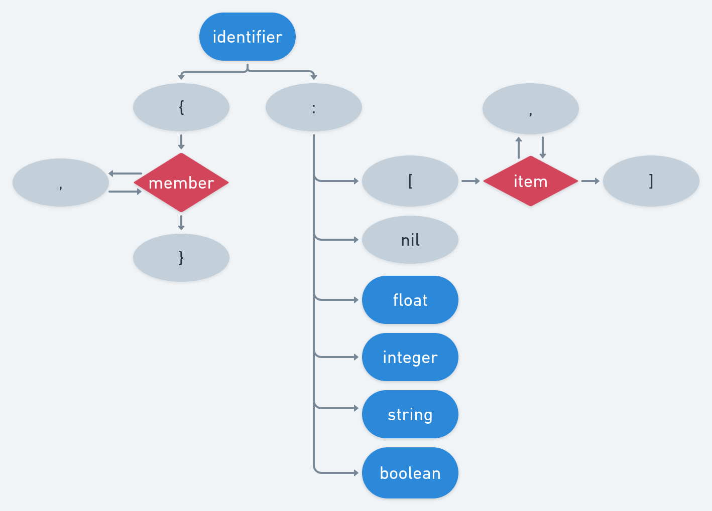

# 👇 About sdata

The sdata language is a minimalist serialization language syntactically very close to JSON.  
The language is designed to be human-readable, performant, easy-to-use and quickly mastered.  
The source code is easily readable and the core doesn't rely on any libraries (fmt will be available soon on clang and gcc
compilers as std::format).

## Syntax

```from 'examples/user.sd'```

```yaml
user {
  first_name: 'ავთანდილი',
  last_name: 'ხვედელიძე',
  gender: 'male',
  country: 'Georgia',
  features {
    age: 58,
    height: 1.890000,
    weight: 82.599998,
    blood_type: 'O+'
  },
  coordinates {
    email: 'eteri94@test130.com',
    username: 'aleksi96',
    password: ':g~=5KP_vm|~cI8',
    phones:  [
      '+61 2 0109 5481',
      '+61 8 1339 3768'
    ]
  },
  meta {
    source: 'https://namefake.com/georgian-georgia/male/c3c0a2f4ce2336fa49ba13e24f978f79'
  }
}
```

### Language graph


### Data types

| Type           | Syntax                       | Example                              |
|----------------|------------------------------|--------------------------------------|
| ```NIL```      | nil                          | empty_node: nil                      |
| ```ARRAY```    | \[\<item\>, \<next\>, ...\]  | even: \[nil, 2,"4",6,8,10,12\]       |
| ```SEQUENCE``` | {\<member\>, \<next\>, ...}  | man { name: "John Doe", age: 32 }    |
| ```FLOAT```    | \<decimal\>f                 | { ratio: 0.8f, seconds: 5.4 }        |
| ```INT```      | \<integer\>                  | size: 2                              |
| ```BOOL```     | \<true/false\>               | { is_open: true, is_closed: false }  |
| ```STRING```   | \'\<data\>\' or \"\<data\>\" | { city: "Shanghai", native: \'上海\' } |

## Build instructions

```bash
mkdir build && cd build
cmake -G<generator> -DSDATA_BUILD_TEST=ON ..
cd ../
build/test/sdata_test
```

### Configuration (see ```cmake/conf.cmake```)

| option                   | description                             |
|--------------------------|-----------------------------------------|
| ```SDATA_BUILD_TEST```   | build sdata's test suite \[OFF\]        |
| ```SDATA_BUILD_FORMAT``` | build sdata format tool \[ON\]          |
| ```SDATA_ASSERTIONS```   | enable inner library assertions \[OFF\] |

## Getting started

```from 'examples/game.cpp'```

```cpp
#include <sdata/sdata.hpp>

// Window properties struct
struct Window {
  unsigned width, height;
  std::string_view title {};
  bool fullscreen;
};

template<>
struct sdata::Serializer<Window> : Scheme<Window(unsigned, unsigned, std::string_view, bool)> {
  Map map(Window &window) override {
    return {
      {"width", window.width},
      {"height", window.height},
      {"title", window.title},
      {"fullscreen", window.fullscreen},
    };
  }
};

void from_file() {
  // Read and parse the sdata source with sdata::parse_file
  Window window = sdata::parse_file("examples/game.sd").at("window");

  // Tweak window settings
  window = Window {.width = 1280, .height = 720, .title = "Hello world"};

  // Deserialize the window to 'window.sd'
  sdata::write_file("examples/window.sd", sdata::Node {"window", window});
}

std::string from_node() {
  // Construct the node hierarchy
  Node window {
    "window",
    {
      {"width", 1280},
      {"height", 720},
      {"fullscreen", true},
    },
  };

  // Use the insertion operator to append a new node to the sequence
  window["title"] = "Hello world";
  // Access the "fullscreen" node with .at() and change its value
  window.at("fullscreen") = false;

  // Return the window source code
  return sdata::write_str(window);
}
```

## sdata_format

sdata_format is a program to format your sdata source code.

```bash
# Usage
sdata_format -s <source filepath> -r <raw source> -f <format sdata source> -t <format template [standard/inlined/standard]>  
# Example
sdata_format -s examples/dialog.sd -t inlined
sdata_format -r "person  {name : \"John Doe\", age    :54    }" -f examples/format.sd
```
